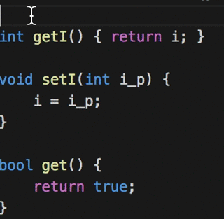
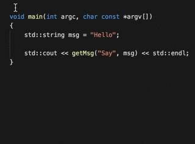

# Generate Doxygen Comments for VS Code

This VS Code Extensions provides Doxygen Documentation generation on the fly by starting a Doxygen comment block and pressing enter.

## Features

Generate Doxygen Comments from method signatures.

From simple setter methods

over declarations

to bool return values.

And some special cases:

Like Constructors

Defintions in header files

Multi line definitions/declarations

Or void return values

## Extension Settings

See [Below](#whats-to-come)

## Known Issues

Completely new extension, so none.

## What's to come

* Suggest smart text

* Configuration options

* Tests

* More languages
  * C++11 and newer

* Improve language support
  * Classes
  * Namespaces
  * Enums
