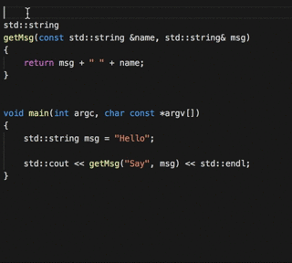
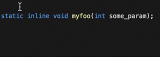

# Generate Doxygen Comments for VS Code

This VS Code Extensions provides Doxygen Documentation generation on the fly by starting a Doxygen comment block and pressing enter.

## Features

Generate Doxygen Comments from method signatures.

From simple setter methods

over declarations

to bool return values.

And some special cases:

Like Constructors

Multi line definitions/declarations

Strip reserved keywords

Or even function pointers

Featuring an extensive generation customization system

Generate documentation for the file you just created

## Extension Settings

See [Below](#whats-to-come)

## Contributors

[Christoph Schlosser](https://github.com/christophschlosser)

[Rowan Goemans](https://github.com/rowanG077)

## Known Issues

[See open bugs](https://github.com/christophschlosser/doxdocgen/labels/bug)

## What's to come

* Suggest smart text

* Configuration options
  * Support more configuration options

* More languages
