# Generate Doxygen Comments in VS Code

This VS Code Extensions provides Doxygen Documentation generation on the fly by starting a Doxygen comment block and pressing enter.

[](https://github.com/cschlosser/doxdocgen/actions/workflows/ci.yml?query=branch%3Amaster)
[](https://github.com/cschlosser/doxdocgen/actions/workflows/cd.yml?query=event%3Arelease++)
[](https://codecov.io/gh/cschlosser/doxdocgen)
[](https://gitter.im/doxdocgen)

## Table of Contents

- [Generate Doxygen Comments in VS Code](#generate-doxygen-comments-in-vs-code)
  - [Table of Contents](#table-of-contents)
  - [Features](#features)
    - [Alignment](#alignment)
    - [Attributes](#attributes)
    - [Con- and Destructors](#con--and-destructors)
    - [Extensive customization](#extensive-customization)
    - [File descriptions](#file-descriptions)
    - [Function pointers](#function-pointers)
    - [Operators](#operators)
    - [Parameters](#parameters)
    - [Return types](#return-types)
    - [Smart text](#smart-text)
      - [Trailing](#trailing)
    - [Templates](#templates)
    - [Auto-complete doxygen commands](#auto-complete-doxygen-commands)
  - [Config options](#config-options)
  - [Contributors](#contributors)
  - [Known Issues](#known-issues)
  - [What's to come](#whats-to-come)

## Features

### Alignment

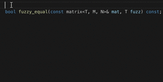

For how this works, see the [CHANGELOG.md](https://github.com/cschlosser/doxdocgen/blob/master/CHANGELOG.md#alignment)

### Attributes

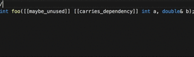

### Con- and Destructors

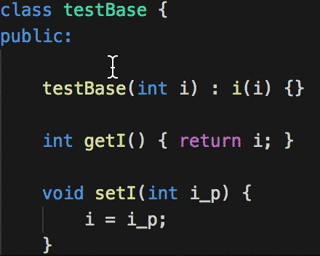
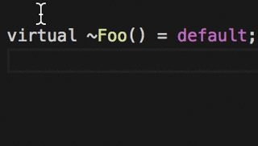

### Extensive customization

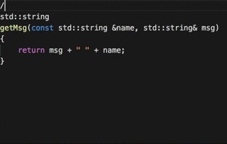

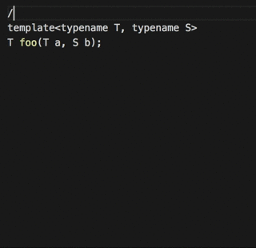

### File descriptions

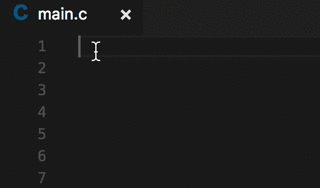

### Function pointers

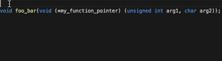

### Operators

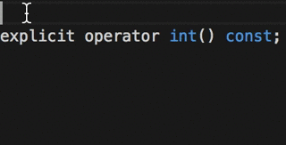


### Parameters

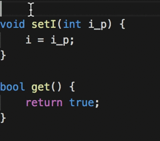
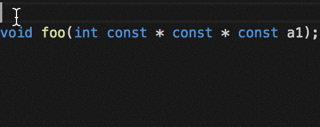

### Return types

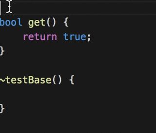
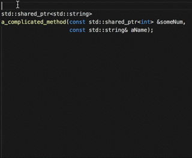

### Smart text

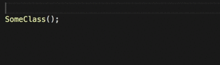
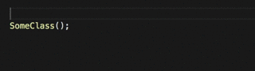
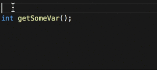

Supported smart text snippets:

* Constructors

* Destructors

* Getters

* Setters

* Factory methods

Each of them can be configured with its own custom text and you can decide if the addon should attempt to split the name of the method according to its case.

#### Trailing

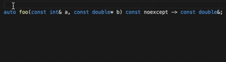

### Templates

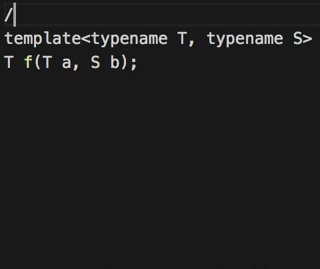
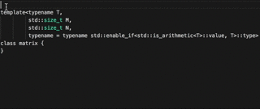

### Auto-complete doxygen commands

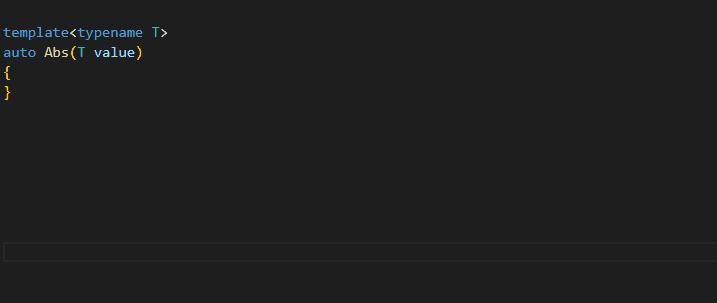


## Config options

```json
  // The prefix that is used for each comment line except for first and last.
  "doxdocgen.c.commentPrefix": " * ",

  // Smart text snippet for factory methods/functions.
  "doxdocgen.c.factoryMethodText": "Create a {name} object",

  // The first line of the comment that gets generated. If empty it won't get generated at all.
  "doxdocgen.c.firstLine": "/**",

  // Smart text snippet for getters.
  "doxdocgen.c.getterText": "Get the {name} object",

  // The last line of the comment that gets generated. If empty it won't get generated at all.
  "doxdocgen.c.lastLine": " */",

  // Smart text snippet for setters.
  "doxdocgen.c.setterText": "Set the {name} object",

  // Doxygen comment trigger. This character sequence triggers generation of Doxygen comments.
  "doxdocgen.c.triggerSequence": "/**",

  // Smart text snippet for constructors.
  "doxdocgen.cpp.ctorText": "Construct a new {name} object",

  // Smart text snippet for destructors.
  "doxdocgen.cpp.dtorText": "Destroy the {name} object",

  // The template of the template parameter Doxygen line(s) that are generated. If empty it won't get generated at all.
  "doxdocgen.cpp.tparamTemplate": "@tparam {param} ",

  // File copyright documentation tag.  Array of strings will be converted to one line per element.  Can template {year}.
  "doxdocgen.file.copyrightTag": [
    "@copyright Copyright (c) {year}"
  ],

  // Additional file documentation. One tag per line will be added. Can template `{year}`, `{date}`, `{author}`, `{email}` and `{file}`. You have to specify the prefix.
  "doxdocgen.file.customTag": [],

  // The order to use for the file comment. Values can be used multiple times. Valid values are shown in default setting.
  "doxdocgen.file.fileOrder": [
    "file",
    "author",
    "brief",
    "version",
    "date",
    "empty",
    "copyright",
    "empty",
    "custom"
  ],

  // The template for the file parameter in Doxygen.
  "doxdocgen.file.fileTemplate": "@file {name}",

  // Version number for the file.
  "doxdocgen.file.versionTag": "@version 0.1",

  // Set the e-mail address of the author.  Replaces {email}.
  "doxdocgen.generic.authorEmail": "you@domain.com",

  // Set the name of the author.  Replaces {author}.
  "doxdocgen.generic.authorName": "your name",

  // Set the style of the author tag and your name.  Can template {author} and {email}.
  "doxdocgen.generic.authorTag": "@author {author} ({email})",

  // If this is enabled a bool return value will be split into true and false return param.
  "doxdocgen.generic.boolReturnsTrueFalse": true,

  // The template of the brief Doxygen line that is generated. If empty it won't get generated at all.
  "doxdocgen.generic.briefTemplate": "@brief {text}",

  // The format to use for the date.
  "doxdocgen.generic.dateFormat": "YYYY-MM-DD",

  // The template for the date parameter in Doxygen.
  "doxdocgen.generic.dateTemplate": "@date {date}",

  // Decide if you want to get smart text for certain commands.
  "doxdocgen.generic.generateSmartText": true,

  // Whether include type information at return.
  "doxdocgen.generic.includeTypeAtReturn": true,

  // How many lines the plugin should look for to find the end of the declaration. Please be aware that setting this value too low could improve the speed of comment generation by a very slim margin but the plugin also may not correctly detect all declarations or definitions anymore.
  "doxdocgen.generic.linesToGet": 20,

  // The order to use for the comment generation. Values can be used multiple times. Valid values are shown in default setting.
  "doxdocgen.generic.order": [
    "brief",
    "empty",
    "tparam",
    "param",
    "return",
    "custom",
    "version",
    "author",
    "date",
    "copyright"
  ],

  // Custom tags to be added to the generic order. One tag per line will be added. Can template `{year}`, `{date}`, `{author}`, `{email}` and `{file}`. You have to specify the prefix.
  "doxdocgen.generic.customTags": [],

  // The template of the param Doxygen line(s) that are generated. If empty it won't get generated at all.
  "doxdocgen.generic.paramTemplate": "@param {param} ",

  // The template of the return Doxygen line that is generated. If empty it won't get generated at all.
  "doxdocgen.generic.returnTemplate": "@return {type} ",

  // Decide if the values put into {name} should be split according to their casing.
  "doxdocgen.generic.splitCasingSmartText": true,

  // Array of keywords that should be removed from the input prior to parsing.
  "doxdocgen.generic.filteredKeywords": [],

  // Substitute {author} with git config --get user.name.
  "doxdocgen.generic.useGitUserName": false,

  // Substitute {email} with git config --get user.email.
  "doxdocgen.generic.useGitUserEmail": false

  // Provide intellisense and snippet for doxygen commands
  "doxdocgen.generic.commandSuggestion": true

  // Add `\\` in doxygen command suggestion for better readbility (need to enable commandSuggestion)
  "doxdocgen.generic.commandSuggestionAddPrefix": false
```

## Contributors

[Christoph Schlosser](https://github.com/cschlosser)

[Rowan Goemans](https://github.com/rowanG077)

## Known Issues

[See open bugs](https://github.com/cschlosser/doxdocgen/labels/bug)

## What's to come

[See open features](https://github.com/cschlosser/doxdocgen/labels/enhancement)
